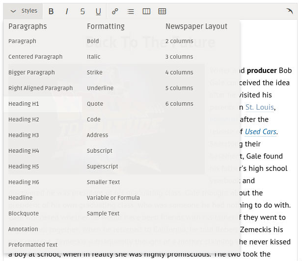

Easywyg content styles
==============

_Create your custom content styles with this boilerplate._

These styles are required in order to view the content in the Easywyg editor corresponds to the appearance of content on your website.

Get the files:

```shell
$ git clone https://github.com/easywyg/content-styles.git
```

Install the stuff

```shell
$ npm install --save-dev
```

Then run

```shell
$ gulp
```

Open browser: http://localhost:9000/

After that, rework styles for your requirements (see scss/content_styles.css)

Then you need to require result `.css` file to Easywyg editor and also to your website layout.
Put this file somewhere, in order for it to available by URL.

Then copy this URL and add it to your website settings in [Dashboard](http://easywyg.com/dashboard/).

Our robot will get this css file, parse it and then, build styles dropdown for you:


